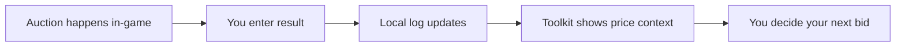

# bid-for-anime-val-toolkit

*A standalone Windows companion for players tracking auctions and item values in Bid for Anime!*

## What this is

This is not a bot that bids for you, not a modified game client, and not anything that touches the Roblox process itself. If you're looking for something that auto-places bids or alters how the game runs, that's a different kind of project — this toolkit doesn't do that, and it never will.

**bid-for-anime-val-toolkit** is a companion app for the Roblox experience *Bid for Anime!*. It runs alongside the game on your desktop and helps you make sense of what's happening in an auction round: what an item last sold for, how a current bid compares to recent history, and how much time is realistically left before a lot closes. It reads publicly visible information you paste or log yourself — it does not read game memory, does not connect to Roblox servers, and does not automate any in-game action. Think of it as a notepad with math built in, made specifically for the pace of *Bid for Anime!* auctions.

  

The button above opens the project's landing page, where the current build is available to download.

## Who it is for

- **New players** trying to learn typical price ranges before joining their first live auction
- **Regular bidders** who want a running log of what items sold for across sessions
- **Trading-focused players** comparing an item's auction price against its trade value
- **Small community groups** who share a spreadsheet-style log of past *Bid for Anime!* rounds
- **Anyone tired of tab-switching** between a chat log and a calculator mid-auction

## What you can do

- **Log completed auctions** with item name, final price, and buyer notes in a few clicks
- **Build a personal price history** per item, viewable as a simple sortable list
- **Compare a live bid** against the median of your last N logged sales for that item
- **Set a soft budget** per session and get a visual warning as you approach it
- **Export your log** to a plain CSV file for spreadsheets or sharing with a group
- **Import a shared log** from a friend or Discord group without overwriting your own entries
- **Tag items** by rarity or series so long lists stay easy to scan
- **Run fully offline** — nothing is uploaded, nothing phones home

## Getting started

1. Open the landing page using the download button above.
2. Grab the latest packaged build for Windows from that page.
3. Extract the folder anywhere you like — no installer, no admin prompt needed.
4. Run the `.exe` inside; the toolkit opens as a normal desktop window.
5. Start a new log, name your session, and begin adding items as auctions happen.

## Requirements

- Windows 10 or Windows 11 (64-bit)
- No .NET, Python, or Node toolchain required — the build is self-contained
- Roughly 60 MB of free disk space
- No Roblox account, login, or in-game permission needed to run the toolkit itself

## How it works

1. You open the toolkit next to your game window, side by side or on a second monitor.
2. As an auction resolves, you type in the item and the final price.
3. The toolkit stores that entry locally and updates the item's running average.
4. On the next round, it shows you where a live bid sits relative to that history.
5. At session end, you can export or clear the log — your data, your choice.

## FAQ

**Is this an official tool for Bid for Anime!?**
No. It's an independent, unofficial companion app built by players for players. It has no connection to the game's servers or developers.

**Does it place bids automatically?**
No. All bidding happens in-game, by you. The toolkit only records and displays numbers you give it.

**Will it get my account flagged?**
The toolkit doesn't interact with Roblox in any way — it doesn't read process memory, network traffic, or the game client — so there's nothing for the game to detect.

**Can I use it on Mac or Linux?**
The packaged build targets Windows 10/11 only for now. There's no macOS or Linux build available on the landing page.

**Where does my logged data go?**
Everything is saved to a local file on your machine. Nothing is sent anywhere unless you manually export and share the CSV yourself.

## Troubleshooting

- **The window opens blank or won't render:** update your Windows display drivers, then relaunch the `.exe`.
- **My CSV import silently fails:** check that the file uses the same column headers as an exported log — mismatched headers are skipped, not merged.
- **Old sessions disappeared after an update:** confirm you extracted the new build into a fresh folder rather than overwriting the old one; local data lives next to the executable.
- **Antivirus flags the download:** this is common for unsigned indie Windows builds; verify you got the file from the landing page linked in this README before allowing it.

## License

Released under the [MIT License](LICENSE). This project is an unofficial, independent tool made by fans and is not affiliated with, endorsed by, or connected to the developers of *Bid for Anime!* or Roblox Corporation. Use it at your own discretion alongside the game's terms of service.

  

